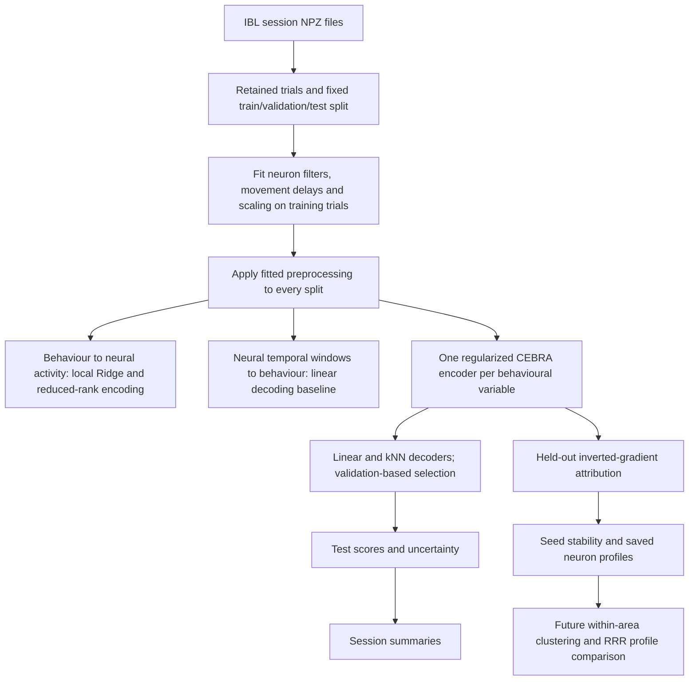

# Historical thesis methods and readiness review

**Implementation update, later on 9 September:** The pre-GPU fixes from this
review are now implemented and locally checked. The current sources of truth are
[PLAN.md](../PLAN.md), [GPU pilot protocol](gpu_pilot.md),
[analysis protocol](analysis_protocol.md) and the
[verification record](pre_gpu_verification_2026-09-09.md).
The historical text below deliberately preserves the audit of commit `59c377c`;
its statements that sampling, diagnostics, clustering or portable workers are
missing do **not** describe the updated working tree. GPU validation, reliable
synthetic attribution recovery, subject metadata and the genuine published RRR
export remain open. The method remains a regularized per-variable adaptation.

**Review date:** 9 September 2026. **Code reviewed:** `59c377c` on `main`.

The project now has a controlled experiment runner and verified CPU execution,
but it is not yet a completed brain-wide scientific analysis. The first priority
is to close the remaining sampling, diagnostic and execution gaps before a long
GPU run. The training objective is currently a **regularized per-variable CEBRA
adaptation**. This report describes implemented behaviour, not intended features.

The supplied PinLab invitation establishes that NAS account details were issued;
it does not establish access to a GPU node. Connection information is retained in
a local Git-ignored note. No password is included in this report, and no login or
training job was attempted.

## 1. Thesis purpose

The thesis asks three related but distinct questions:

1. Does a nonlinear contrastive representation improve behavioural decoding on
   held-out trials relative to matched neural-input baselines?
2. Do neuron-attribution profiles show reproducible within-area clusters beyond
   a suitable null, and how do those profiles compare with RRR selectivity?
3. How does representation consistency across independently trained models
   change with embedding dimension?

The controlled runner supports experiments for questions 1 and 3. It saves
attributions for question 2, but the complete clustering/null-analysis workflow
is still missing. Neither attractive embedding plots nor high decoding accuracy
alone resolves question 2.

## 2. Current project architecture

The recommended entry point is `python -m xcebra_ibl.experiments`. It loads raw
sessions one at a time, rather than trusting historical preprocessed caches.
`kaggle_train.py` and the small Kaggle launcher are infrastructure wrappers;
the experiment code can also run on a university Linux GPU machine.

The older `run_pipeline.py`, Hydra configuration, training functions and
`analysis/selectivity.py` remain in the repository. They do not automatically
consume all the new pilot outputs. In particular, the older area-analysis code
expects a neuron-results table, whereas the pilot writes per-combination NPZ
files and score JSON files. A deliberate adapter is needed to connect them.

## 3. Data and preprocessing

The local raw directory contains **205 NPZ session files**. This is an input
inventory, not evidence that all sessions pass inclusion or match the published
cortical cohort. Each session contains spike activity, task labels, movement
signals and neuron metadata.

The eight labels are block prior, stimulus side, contrast level, choice, outcome,
wheel velocity, whisker motion and licking. The first five are categorical;
the three movement variables are continuous. Outcome is currently derived from
stimulus-side/choice agreement in the exported behaviour strings. Its meaning
should be checked against feedback/reward metadata before calling it actual
reward delivery, especially for special trial types.

The implementation follows the reference RRR preprocessing conventions:

- Use a nominal 10 ms bin interval and trim neural bins with `10:-11`.
- Multiply the exported neural matrix by the bin duration, following the
  reference conversion. Document the export's units explicitly.
- Remove trials with a 0.5 prior block. Require at least 100 retained trials and
  five retained neurons. The trial threshold currently concerns the retained
  session, not the smaller training subset.
- On training trials, require firing rate above 0.5 Hz and silent-trial
  probability below 0.5. Apply the configured unit-quality threshold.
- Exclude `root`, `void` and `y`. The listed 43 cortical areas are **not** an
  automatic inclusion restriction in the pilot, so it can include noncortical
  units. Also, the declared maximum-firing-rate constant is not an applied
  upper filter in this path. Decide and document the intended cohort.
- Fit movement alignment by cross-correlation using training trials, with the
  reference fallback delay. Apply the fitted delay to validation/test trials.
- Smooth neural activity within each trial with Gaussian sigma 2 bins.
- Fit neural and behavioural scaling on training trials and apply it unchanged
  to other splits. Keep categorical class identities separate from scaled values.

Neural scaling is **per neuron and per time bin across trials**, rather than one
mean and variance per neuron over the entire recording. This changes the target
representation: average trial-aligned activity is removed. State this clearly
when interpreting biological response profiles. Symmetric smoothing and temporal
windows support offline decoding; they do not establish prospective prediction.

The split is approximately 60% training, 20% validation and 20% test, by retained
trial, using a fixed split seed. It is shared by all candidate models within a
session. This measures within-session held-out-trial generalization. It does not
establish generalization to new animals, new sessions or a later recording period.

## 4. Contrastive model and attribution

For each variable, an `offset10-model` encoder maps a neural population window to
a small embedding. Categorical labels select same-class positive sampling;
continuous labels use CEBRA's time-difference-conditioned sampler. Contrastive
learning encourages appropriately paired observations to have similar embeddings
relative to negative samples.

The loss combines the contrastive objective with Jacobian regularization:

\[
\mathcal L = \mathcal L_{contrastive} + \lambda R_J,\qquad \lambda=0.01.
\]

The installed regularized solver computes its Jacobian penalty with all output
directions. Current defaults include 128 hidden units, learning rate 0.0003,
temperature 1, batch size 512 and a 10-bin conditional time offset. The pilot
uses 500 iterations; the model-level configuration still has a 10,000-iteration
default. Effective settings depend on the entry point, another reason to unify
configuration before the final run.

Each variable gets an **independent encoder**. Eight four-dimensional models are
not a single shared 32-dimensional disentangled model. The official xCEBRA demo
uses a shared encoder with multiple contrastive objectives and defined output
slices, plus Jacobian regularization. The current adaptation should retain its
explicit name unless that implementation is added and tested. [Official demo](https://cebra.ai/docs/demo_notebooks/Demo_xCEBRA_RatInABox.html).

For attribution, the code computes the encoder Jacobian at sampled held-out
windows, averages temporal derivatives across the receptive field, takes its
Moore–Penrose pseudoinverse, and averages the absolute entries over samples and
embedding coordinates. The SVD cutoff is `1e-5`; the final partial batch now
receives the correct sample weight.

These values are model attribution scores in standardized coordinates. They are
not directly equivalent to RRR coefficients or unique causal effects of the
label. Correlated task variables can produce similar attribution profiles. The
xCEBRA paper's identifiability results rely on assumptions; a passing algebraic
unit test does not validate those assumptions on IBL recordings. [xCEBRA paper](https://proceedings.mlr.press/v258/schneider25a.html).

## 5. Encoding, decoding and evaluation

| Analysis | Input → target | Implemented method | What the result measures |
|---|---|---|---|
| Neural decoding baseline | Neural windows → behaviour | Ridge for continuous labels; logistic regression for categories | Behaviour recoverable directly from matched neural inputs |
| Embedding decoding | CEBRA embedding → behaviour | Ridge/logistic and kNN | Behaviour recoverable from the learned representation |
| Local encoding | Eight task variables → neural activity | Separate time-bin Ridge fits and rank-projected variants, ranks 2/4/8 | Held-out neural-response prediction under these local linear models |
| Attribution | Trained encoder and neural windows → neuron scores | Averaged absolute inverted Jacobian | Which neural inputs support the fitted representation |
| Stability | Independent seeds at the same dimension | Validation-fitted alignment and test R²; attribution Spearman correlation | Repeatability conditional on the data and model design |

Raw-neural decoding uses the same channels and temporal receptive field and
scores interior trial bins. It has linear decoders; expensive raw-neural kNN is
not included. Comparisons should distinguish changes in representation from
changes in decoder family.

Decoder regularization or neighbour count is selected using validation trials.
Embedding dimension is selected per variable and decoder family by averaging
observed-model validation scores across seeds. Test scores are then reported
for the selected dimension. Stability across dimensions is reported separately;
it is **not currently the dimension-selection criterion**. A thesis claim that
consistency selected the dimension needs a corresponding predeclared rule.

The local encoding implementation is a time-resolved Ridge fit followed by a
projection for the reduced-rank variants. It is not a reproduction of the paper's
global RRR estimator. The original RRR export paths still contain 14-byte and
135-byte placeholders. A direct published-result comparison remains unavailable.

Continuous decoding uses R²; categorical decoding uses balanced accuracy.
Degenerate decoding targets return an unavailable score. The pipeline estimates
95% intervals by resampling complete test trials, then averages seeds within
sessions before resampling sessions for an aggregate summary. These intervals
are conditional on fitted models and selected dimensions. Three sessions provide
limited population evidence, and sessions from the same mouse are not independent
animals. Paired intervals for the *improvement over baseline* are not yet computed.

## 6. Null controls and validation evidence

A control uses one joint permutation of complete training-trial label trajectories
across all variables. It retrains both the encoder and decoder on those permuted
labels; validation and test targets retain their original assignment. Temporal
structure within each trial and dependence between labels are preserved.

This is a useful negative control, but not yet a calibrated significance test.
Arbitrary trial permutations can break block structure or drift, and common
trial-time structure can survive the shuffle. The default single permutation is
an engineering diagnostic. More controls and a stated exchangeability assumption
are needed for inferential claims; simply increasing their number does not fix
an inappropriate null.

On 9 September, all four current unit tests passed again: split/shuffle integrity,
training-only preprocessing invariance, a known linear pseudoinverse with a
disconnected neuron, and attribution invariance to batch partition.

The saved 5 September verification record documents 16 synthetic CPU encoder
fits at two iterations, including continuous/categorical variables, two seeds,
two dimensions, observed/null training, model reload and resume checks. That
integration run was not repeated during this report review. It validates basic
execution, not convergence, useful embeddings or learned connectivity recovery.

A new, small sampler inspection used four artificial 30-bin trials. After the
trial-window patch, the continuous sampler still contained 30 differences formed
across trial boundaries at the configured 10-bin offset. This confirms a remaining
training-distribution issue. It is not train/test leakage: it is an artificial
adjacency between otherwise separate training trials.

## 7. What remains, in priority order

| Priority | Concrete work | Reason and acceptance criterion |
|---|---|---|
| Before GPU pilot | Make continuous-label time-difference estimation trial-aware | Exclude differences spanning trial IDs; test sampler behaviour as well as windows. Positive neighbours may legitimately occur in different trials; the issue is how their conditioning differences are estimated. |
| Before GPU pilot | Make boundary-window handling consistent with labels and inference | Training currently moves an edge window's centre inward while retaining the sampled label index. Use valid centres consistently or centre-preserving padding; test with changing movement labels. |
| Before GPU pilot | Export full optimization diagnostics | `losses.json` currently exports the solver's contrastive history. Export total regularized loss, raw/weighted regularizer, temperature and finite/gradient diagnostics; the solver already records several of these. |
| Before GPU pilot | Run a realistic raw-session smoke test and freeze a Linux/CUDA environment | The tests are synthetic, and most dependency versions remain lower bounds. Check actual data scale, sampler memory, numerical warnings and package compatibility. |
| Before expensive scaling | Unify configuration and checkpoint semantics | Save one resolved config; validate completed artifacts rather than trusting marker existence; support graceful interruption and useful restart granularity. Current partial combinations restart from the beginning. |
| Before expensive scaling | Add scheduler-compatible job partitioning, profiling and explicit session selection | A university cluster may require a scheduler. Add one session/seed/dimension/control job per work unit, scratch/output paths, runtime/VRAM estimates and deterministic merging. Do this after receiving infrastructure details. |
| Before final evaluation | Finalize the cohort and inferential design | Decide cortical inclusion, preserve subject IDs, report label counts, reserve confirmatory sessions, and add paired baseline improvements and an appropriate block/subject-aware uncertainty strategy. |
| Before xCEBRA-specific claims | Decide canonical implementation and run learned synthetic recovery | Either retain the clearly labelled adaptation or implement official multiobjective training; test recovery on a known generative graph and regularization sensitivity. |
| Before clustering claims | Connect pilot artifacts to neuron/area analysis and implement the full null workflow | Join neuron IDs safely, control session/area composition, assess clustering reproducibility and silhouettes, fit suitable Gaussian nulls, and correct multiple comparisons. |
| Before published-RRR comparison | Obtain actual RRR artifacts or reproduce the reference estimator | Align neuron/session identities, inclusion rules and preprocessing. Label local Ridge comparisons separately. |

Additional useful cleanup: persist trained decoders and their scalers, archive
encoding intercepts as well as coefficients, vectorize the Python trial-window
expander, avoid materializing all neural-context copies for large sessions, and
split the experiment runner into preprocessing, fitting, evaluation and reporting
modules. These improve reproducibility and cost; they do not substitute for the
scientific controls above.

## 8. Training sequence and expected outputs

After the sampling/diagnostic fixes, use a short real-data CPU check, then one
GPU calibration session. The existing Kaggle calibration is one session, one
seed, dimension 4, eight variables and one null: **16 encoder fits** at 500
iterations. Use its measured runtime and peak memory to choose the next stage.

The full pilot is three sessions × three seeds × three dimensions × two conditions
× eight variables = **432 encoder fits**, or 216,000 optimizer steps at 500
iterations. Dimensions and neuron counts change per-fit cost, so extrapolate
conservatively. Do not run the whole dataset at 10,000 iterations by default.
Use validation/convergence evidence to set the final schedule, then evaluate
previously reserved data.

Expected artifacts include data/code hashes and environment metadata; retained
trial/neuron indices and preprocessing statistics; final encoders and checkpoints;
embeddings; encoding coefficients and predictions; decoding predictions and scores;
held-out neuron attributions; seed-stability results; and session summaries.
Existing output files are not automatically final thesis evidence: their method,
split, provenance and interpretation must match the final protocol.

## 9. Infrastructure handoff

The NAS invitation is useful for the later storage/access setup. To configure
training, obtain the compute/login hostname, authentication method, VPN needs,
GPU model and VRAM, scheduler/allocation instructions, allowed job duration,
and persistent/scratch storage paths and quotas. The NAS may serve as shared
storage; its account alone does not prove GPU-node or SSH access.

This review created documentation and the local access note only. It did not
modify training code, push a commit, contact the administrator or use the NAS.
The next implementation pass should start with trial-aware sampling and full
loss diagnostics, then move to realistic execution and cluster setup.
